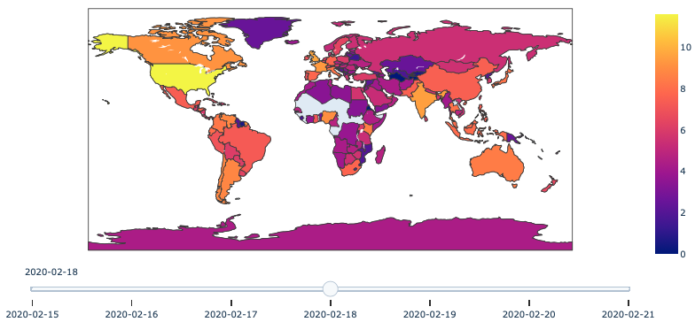

# sma-twitter-hashtags-popularity-visualization

Assignment for the Social Media Analysis course at WUST (Wroclaw University of Science and Technology).

### Project goal
Interactive map of countries with visualization of how popular were some of the hashtags related to COVID through time and space. Based on datasets from [this site](http://twitterdata.covid19dataresources.org/download).

### Scope: knowledge and skils
* Docker
* Jupyter IPython Notebooks
* Python:  
    * data organization: Pandas, GeoPandas
    * visualization: Plotly, Folium

### Outcome
The analysis answers the following questions:
* What is a distribution of COVID-related hashtags over countries?
* Which countries prefered which hashtags?
* How it was changing over time?

Interactive map screenshot
